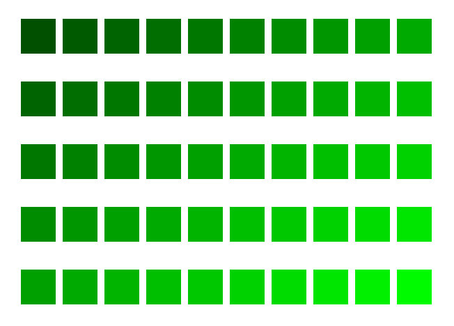

# T1: Programação funcional em Haskell
## Funções

1. Crie uma função `isVowel :: Char -> Bool` que verifique se um caracter é uma vogal ou não.
2. Escreva uma função `addComma`, que adicione uma vírgula no final de cada string contida numa lista.
3. Crie uma função `htmlListItems :: [String] -> [String]`, que receba uma lista de strings e retorne outra lista contendo as strings formatadas como itens de lista em HTML. Resolva este exercício COM e SEM [funções anônimas (lambda)](https://wiki.haskell.org/Anonymous_function). Exemplo de uso da função:
   ```
   > htmlListItems ["abra", "ca", "dabra"]
   ["<LI>abra</LI>", "<LI>ca</LI>", "<LI>dabra</LI>"]
   ```
4. Defina uma função que receba uma string e produza outra retirando as vogais, conforme os exemplos abaixo. Resolva este exercício COM e SEM [funções anônimas (lambda)](https://wiki.haskell.org/Anonymous_function).
   ```
   > semVogais "andrea"
   "ndr"
   > semVogais "xyz"
   "xyz"
   > semVogais "ae"
   ""
   ```
5. Defina uma função que receba uma string, possivelmente contendo espaços, e que retorne outra string substituindo os demais caracteres por '-', mas mantendo os espaços. Resolva este exercício COM e SEM [funções anônimas (lambda)](https://wiki.haskell.org/Anonymous_function). Exemplos:
   ```
   > codifica "Rio Grande do Sul"
   "--- ------ -- ---"
   > codifica ""
   ""
   ```
6. Escreva uma função `firstName :: String -> String` que, dado o nome completo de uma pessoa, obtenha seu primeiro nome. Suponha que cada parte do nome seja separada por um espaço e que não existam espaços no início ou fim do nome. Dica: estude funções pré-definidas em Haskell (List operations -> Sublists) em http://hackage.haskell.org/package/base-4.10.1.0/docs/Prelude.html#g:18.  Exemplos de uso da função:
   ```
   > firstName "Anderson Silva"
   "Anderson"
   > firstName "JON BON JOVI"
   "JON"
   ```
7. Escreva uma função `isInt :: String -> Bool` que verifique se uma dada string só contém dígitos de 0 a 9. Exemplos:
   ```
   > isInt "901"
   True
   > isInt "2014a"
   False
   ```
8. Escreva uma função `lastName :: String -> String` que, dado o nome completo de uma pessoa, obtenha seu último sobrenome. Suponha que cada parte do nome seja separada por um espaço e que não existam espaços no início ou fim do nome. Exemplos de uso da função:
   ```
   > lastName "Anderson Silva"
   "Silva"
   > lastName "JON BON JOVI"
   "JOVI"
   ```
9. Escreva uma função `userName :: String -> String` que, dado o nome completo de uma pessoa, crie um nome de usuário (login) da pessoa, formado por: primeira letra do nome seguida do sobrenome, tudo em minúsculas. Dica: estude as funções pré-definidas no módulo [Data.Char](http://hackage.haskell.org/package/base-4.10.1.0/docs/Data-Char.html), para manipulação de maiúsculas e minúsculas. Você precisará carregar este módulo usando `import Data.Char` no interpretador ou no início do arquivo do programa.
   Exemplos de uso da função:
   ```
   > userName "Anderson Silva"
   "asilva"
   > userName "JON BON JOVI"
   "jjovi"
   ```
10. Escreva uma função `encodeName :: String -> String` que substitua vogais em uma string, conforme o esquema a seguir: a = 4, e = 3, i = 2, o = 1, u = 0.
    Exemplos de uso da função:
    ```
    > encodeName "Anderson Silva"
    "4nd3rs1n s2lv4"
    > encodeName "Badtz Maru"
    "B4dtz M4r0"
    ```
11. Escreva uma função `betterEncodeName :: String -> String` que substitua vogais em uma string, conforme este esquema: a = 4, e = 3, i = 1, o = 0, u = 00.  Exemplos de uso da função:
    ```
    > betterEncodeName "Anderson Silva"
    "4nd3rs0n s1lv4"
    > betterEncodeName "Badtz Maru"
    "B4dtz M4r00"
    ```
12. Dada uma lista de strings, produzir outra lista com strings de 10 caracteres, usando o seguinte esquema: strings de entrada com mais de 10 caracteres são truncadas, strings com até 10 caracteres são completadas com '.' até ficarem com 10 caracteres. Exemplo:
    ```
    > func ["palavras","paralelas","pedal","paralelepipedo"]
    ["palavras..","paralelas.","pedal.....","paralelepi"]
    ```


# T2: Geração de SVG em Haskell

Neste trabalho, você vai criar um programa em Haskell para gerar arquivos em formato SVG com formas geométricas coloridas, dispostas em alguns padrões.

Você deverá gerar no mínimo 4 padrões diferentes, inspirados nas figuras abaixo:

| Caso 1 | Caso 2 | Caso 3 | Caso 4 |  
| :---: | :---: | :---: | :---: |  
|  |  |  |  |  
| [case1.svg](figs/case1.svg) | [case2.svg](figs/case2.svg) | [case3.svg](figs/case3.svg) | [case4.svg](figs/case4.svg) |  

Para isso, seu programa nomeado `t2.hs` deverá implementar 4 funções: 
- `genCase1 :: IO ()` : gera matriz de retângulos de cores diferentes
- `genCase2 :: IO ()` : gera círculos dispostos sobre um círculo
- `genCase3 :: IO ()` : gera matriz com círculos sobrepostos
- `genCase4 :: IO ()` : gera círculos dispostos sobre senoides

A geração de figuras e cores deve ser feita programaticamente, por meio de funções que você terá que definir. Nessas funções, evite usar valores *hard-coded*. Calcule posições e cores a partir de argumentos passados para as funções, definindo constantes quando necessário.

As figuras que você vai gerar não precisam ser idênticas aos casos acima, mas devem seguir os mesmos padrões. Para cada caso, você pode variar as cores, a quantidade de figuras, a quantidade de repetições e o espaçamento entre as figuras.

## Dicas

- As funções trigonométricas `sin` e `cos` do Haskell recebem argumento em radianos.
- Relembre como se faz a conversão de graus para radianos.
- Haskell tem a constante `pi` pré-definida.
- Relembre o que você já estudou sobre as equações paramétricas da circunferência.


# T3: Programação lógica em Prolog

1. Defina um predicado `odd(N)` que seja verdadeiro se N for um número ímpar. Exemplo de uso:
   
   ```
   ?- impar(2).
   false.
   ?- impar(3).
   true.
   ``` 
2. Defina um predicado **recursivo** `hasN(L,N)` que seja verdadeiro se L for uma lista de N elementos.
3. Defina um predicado **recursivo** `inc99(L1,L2)`, de forma que L2 seja uma lista com todos os elementos de L1 acrescidos da constante `99`.
4. Defina um predicado **recursivo** `incN(L1,L2,N)`, de forma que L2 seja uma lista com todos os elementos de L1 acrescidos da constante `N`.
5. Defina um predicado **recursivo** `comment(L1,L2)`, de forma que L1 seja uma lista de strings e L2 tenha todos os elementos de L1 concatenados com o prefixo "%%". Dica: consulte predicados Prolog para [manipulação de strings](http://www.swi-prolog.org/pldoc/man?section=string-predicates).
6. Defina um predicado **recursivo** `onlyEven(L1,L2)`, de forma que L2 seja uma lista só com os elementos pares de L1, conforme o exemplo abaixo:
   ```
   ?- onlyEven2([1,2,3,4,5,6,7],L).
   L = [2, 4, 6].
   ```
7. Defina um predicado **recursivo** `countdown(N,L)`, de forma que L seja uma lista com os números [N, N-1, N-2, .., 1], sendo N um número positivo. Exemplo:
   ```
   ?- countdown(7,L).
   L = [7, 6, 5, 4, 3, 2, 1].
   ```
8. Defina um predicado **recursivo** `nRandoms(N,L)`, de forma que L seja uma lista com N números gerados aleatoriamente, conforme os exemplos abaixo:
   ```
   ?- nRandoms(3,L).
   L = [60, 92, 28].

   ?- nRandoms(6,L).
   L = [12, 81, 46, 19, 81, 21].

   ?- nRandoms(0,L).
   L = [].
   ```
9. Defina um predicado **recursivo** `potN0(N,L)`, de forma que L seja uma lista de potências de 2, com expoentes de N a 0. Exemplo de uso:
   ```
   ?- potN0(7,L).
   L = [128, 64, 32, 16, 8, 4, 2, 1]
   ```
10. Defina um predicado **recursivo** `zipmult(L1,L2,L3)`, de forma que cada elemento da lista L3 seja **o produto** dos elementos de L1 e L2 na mesma posição do elemento de L3. Exemplo:
    ```
    ?- zipmult([1,2,3],[2,2,2],L). 
    L = [2, 4, 6].
    ```
11. Defina um predicado **recursivo** `potencias(N,L)`, de forma que L seja uma lista com as N primeiras potências de 2, sendo a primeira 2^0 e assim por diante, conforme o exemplo abaixo:
    ```
    ?- potencias(5,L). 
    L = [1, 2, 4, 8, 16]
    ?- potencias(0,L).
    L = []
    ```
    Dica: defina um predicado auxiliar.

12. Defina um predicao **recursivo** `cedulas(V,L1,L2)`, que receba um valor V e uma lista L1 de cédulas com valores em Reais (R$), em ordem decrescente, e obtenha a lista L2 decompondo o valor V em 0 ou mais cédulas de cada tipo. Exemplo:
    ```
    ?- cedulas(423,[100,50,20,10,5,2,1],L).
    L = [4, 0, 1, 0, 0, 1, 1].
    ```
    Obs.: O resultado acima significa 4 cédulas de 100, 0 de 50, 1 de 20, e assim por diante.


# T4: Resolva um mistério em Prolog

## O Mistério

Em uma manhã de sábado, o inspetor Hercule Poirot foi requisitado para solucionar um mistério da morte de Anita, que foi assassinada no apartamento que dividia com algumas pessoas.

 O inspetor viu indícios de que o crime aconteceu na sexta ou na quinta-feira e foi cometido por apenas uma pessoa. Ele também viu três possíveis motivos para o crime: dinheiro, ciúme ou insanidade. Além disso, o agressor devia ser alguém que dividia o apartamento com Anita.

Poirot estabeleceu que as armas do crime poderiam ser:
- O bastão de baseball que foi roubado do amigo pobre de Anita, Bernardo, na quinta-feira em Porto Alegre ou na quarta-feira em Santa Maria; OU
- O martelo que foi roubado da caixa de ferramentas do apartamento na quarta ou na quinta-feira.


O assassino entrou no quarto de Anita utilizando a chave que roubou dela. Esta chave foi roubada na ~~quarta-feira~~ **segunda-feira** em Santa Maria ou na terça-feira em Porto Alegre. Dinheiro foi roubado do quarto de Anita e sua amiga Bia, que é pobre, tem uma cópia da chave.
Anita tem um relacionamento com Bernardo, que por sua vez teve um relacionamento com a garota rica Caren. Além disso, Anita teve um relacionamento com Pedro, que é pobre e namorou com a garota rica Alice. Alice namorou com o igualmente rico Henrique. Henrique tinha sido noivo de Maria, que é pobre. Maria costumava sair com Adriano, que é rico, e já namorou com a menina rica Caren.

Pedro estava em Santa Maria na segunda e na terça-feira, em Porto Alegre na quarta, em Santa Maria novamente na quinta e depois voltou ao apartamento. 
Caren ficou em Porto Alegre de segunda a quarta-feira, esteve em Santa Maria na quinta e na sexta ficou no apartamento.
Henrique esteve no apartamento na segunda, em Porto Alegre na terça e depois voltou para o apartamento.
Bia passou a segunda-feira no apartamento, esteve em Porto Alegre na terça e quarta e foi para Santa Maria na quinta, então retornou para o apartamento na sexta-feira.
Adriano estava em Santa Maria quarta-feira e ficou no apartamento o resto da semana.
Alice estava em Porto Alegre terça e quarta-feira e no apartamento segunda, quinta e sexta-feira.
Bernardo estava em Santa Maria segunda e terça-feira, em Porto Alegre na quarta-feira, em Santa Maria novamente na quinta-feira e no apartamento na sexta.
Maria esteve em Santa Maria de terça a quinta-feira e no apartamento na segunda e na sexta-feira.
Adriano e Maria já visitaram um psiquiatra para tratar transtornos psicóticos.

## O Trabalho

Sua tarefa é escrever um programa em Prolog que ajude Hercule Poirot a encontrar o(a) assassino(a)!
Algumas dicas:

1. Use predicados para definir onde cada pessoa estava em cada dia e com quem já se relacionou. Defina também quem é vítima, pobre ou insano. Por exemplo:
   ```prolog
   insano(adriano).
   vitima(anita).
   ```
2. Para responder quem é o assassino, você pode usar a regra: `assassino(X) :- motivo(X), acesso(X).`
  - O motivo do crime pode ser: ciúmes, insanidade ou dinheiro.
  - O predicado ``acesso`` deve verificar se ``X``: 
    - Pode ter roubado a arma.
    - Pode ter roubado a chave.
    - Estava no apartamento no momento do crime.


# T5: RandomPicker e suas duas UIs

## Objetivo

Neste trabalho, você vai desenvolver dois programas em Java com a mesma funcionalidade principal, porém com diferentes interfaces com o usuário (*user interfaces* - UIs). A funcionalidade principal é a seleção de itens aleatoriamente a partir de uma data lista, sem reposição (isto é, a cada seleção obtém-se um novo item da lista, até esgotarem-se os itens). Um dos programas terá interface textual, por linha de comando, e o outro terá interface gráfica. Chamaremos estes programas de `RandomPickerCmd` e `RandomPickerGUI`, respectivamente. Ambos os programas deverão implementar o embaralhamento dos itens recebidos de duas formas: uma *offline* e outra *online*, usando o site [random.org](htto://random.org). Seu maior objetivo será empregar os conceitos de orientação a objetos para organizar seu código, de forma que algumas classes possam ser usadas pelos dois programas.

## RandomPickerCmd.java

- O programa com interface textual deverá receber um nome de arquivo na linha de comando. Exemplo de uso:
  ```
  java RandomPickerCmd names.txt
  ```

- Esse arquivo deverá conter uma lista de strings (um item por linha), como [neste exemplo](names.txt).

- O programa deverá embaralhar os itens recebidos e mostrar um item de cada vez, aguardando um comando do usuário (por exemplo, um Enter).

## RandomPickerGUI.java

O programa com interface gráfica deverá conter os seguintes componentes: 

  - Uma barra de menus ([MenuBar](https://docs.oracle.com/javase/8/javafx/api/javafx/scene/control/MenuBar.html) contendo um [Menu](https://docs.oracle.com/javase/8/javafx/api/javafx/scene/control/Menu.html) "File" e um [Menu](https://docs.oracle.com/javase/8/javafx/api/javafx/scene/control/Menu.html) "Help". No Menu "File", haverá dois itens ([MenuItem](https://docs.oracle.com/javase/8/javafx/api/javafx/scene/control/MenuItem.html)): "Open" e "Exit". O item "Open" deverá abrir um [FileChooser](https://docs.oracle.com/javafx/2/ui_controls/file-chooser.htm) para escolha do arquivo. O item "Exit" deverá fechar a aplicação. No menu "Help", haverá somente um item "About", que mostrará o nome do programa e do autor.

  - Uma [TextArea](https://docs.oracle.com/javase/8/javafx/api/javafx/scene/control/TextArea.html) que deverá mostrar o conteúdo do arquivo aberto com "File -> Open". Essa mesma TextArea deverá permitir que o usuário digite strings ao invés de obtê-las de um arquivo.

  - Um botão "Shuffle" para embaralhar a lista, isto é, reordenar os itens aleatoriamente. A lista embaralhada não será mostrada ao usuário de uma só vez - o usuário usará o botão "Next" para obter um item da lista a cada clique.

  - Um botão "Next", inicialmente desabilitado. Quando o usuário clicar em "Shuffle", o botão "Next" será habilitado e causará a apresentação, na interface gráfica, de um item da lista embaralhada. Quando forem apresentados todos os itens (por sucessivos cliques em "Next"), o botão "Next" deverá ser desabilitado novamente.

  - Um label que mostrará um item de cada vez, conforme o usuário clicar em "Next".

## Embaralhamento

Para ambos os programas, o embaralhamento deverá ser implementado de duas formas: uma *offline* e outra *online*. A forma *offline* pode usar algum método do SDK do Java. A forma *online* deverá usar o site [random.org](http://random.org). Para isso, é fornecido um [exemplo de programa](DemoPostRandomOrg.java) que faz uma requisição web a esse site.

A escolha da implementação de embaralhamento deverá ser transparente ao usuário, ou seja, o próprio programa decidirá qual implementação utilizar. Para isso, o programa pode verificar, por exemplo, a disponibilidade do site random.org, a quantidade de itens a embaralhar, etc.

Embora seja suficiente implementar 2 formas de embaralhamento, seu código deverá ser organizado de forma a facilitar a adição, remoção ou localização de implementações de embaralhamento. 

## Coding Style

Você já deve ter notado que códigos em Java costumam seguir convenções diferentes de C para nomes (de variáveis, de métodos, etc.) e para outros detalhes de "estilo" do código. Acostume-se com isso e procure seguir alguma convenção documentada, como por exemplo em: https://google.github.io/styleguide/javaguide.html (veja principalmente a seção 5, sobre Naming).


# T6: ENADE UFSM Explorer em JavaFX

## Objetivo

Neste trabalho, você vai desenvolver um programa orientado a objetos, usando JavaFX, para explorar uma planilha com dados do desempenho dos seus veteranos no [ENADE](http://inep.gov.br/enade) (Exame Nacional de Desempenho de Estudantes)! O ENADE é uma avaliação do MEC aplicada a concluintes de cursos de graduação, com periodicidade trienal. A próxima avaliação da área de Computação será para concluintes em 2020. Os dados das avaliações anteriores são públicos, mas estão distribuídos em diferentes documentos. Alguns dados relevantes para os cursos da área de Computação da UFSM foram compilados em uma planilha, e seu programa permitirá explorar esses dados para sanar algumas curiosidades :-D. 

## Requisitos

O programa com interface gráfica deverá conter os seguintes **componentes**: 

  - Uma [TableView](https://docs.google.com/presentation/d/11uSC-d5hOS5ZkVusmx6GstCLF-zY_DzqqFKW0dBYS6U/edit?usp=sharing) com 9 colunas: Ano, Prova, Tipo Questão, Id Questão, Objeto, Acertos Curso, Acertos Região, Acertos Brasil, Dif. (Curso-Brasil). Essa TableView deverá ser preenchida automaticamente quando o programa inicia, da seguinte forma: (1) se existir um arquivo local (default: `enade.csv`), o programa deve ler os dados deste arquivo; (2) se o arquivo local não existir, o programa deve fazer download de uma planilha que está online, usando uma URL default: [CC](https://docs.google.com/spreadsheets/d/e/2PACX-1vTO06Jdr3J1kPYoTPRkdUaq8XuslvSD5--FPMht-ilVBT1gExJXDPTiX0P3FsrxV5VKUZJrIUtH1wvN/pub?gid=0&single=true&output=csv) ou [SI](https://docs.google.com/spreadsheets/d/e/2PACX-1vTO06Jdr3J1kPYoTPRkdUaq8XuslvSD5--FPMht-ilVBT1gExJXDPTiX0P3FsrxV5VKUZJrIUtH1wvN/pub?gid=1285855524&single=true&output=csv). Após o download, o arquivo será salvo em `enade.csv`. Os dados das 9 colunas da TableView serão provenientes das colunas B, C, D, E, F, I, J, K e L da planilha, respectivamente.

  - Quando uma linha da tabela (questão) for selecionada, o programa deverá abrir uma nova janela "modal" (`Modality.WINDOW_MODAL`), que vai se sobrepor à janela principal do programa (o usuário não poderá mais interagir com a janela principal). Nessa janela "modal", serão mostrados todos os dados anteriores sobre a questão selecionada, com layout à sua escolha, acrescidos de mais 2 atributos: Gabarito (coluna H da planilha) e Imagem (URL na coluna R da planilha). A URL na coluna R designa uma imagem da questão (um recorte feito a partir do arquivo da prova). Somente algumas questões possuem imagens por enquanto, então você deve tratar casos com e sem imagem. Atenção: essas imagens têm dimensões variadas.

  - Uma barra de menus ([MenuBar](https://docs.oracle.com/javase/8/javafx/api/javafx/scene/control/MenuBar.html)) contendo um [Menu](https://docs.oracle.com/javase/8/javafx/api/javafx/scene/control/Menu.html) "File" e um [Menu](https://docs.oracle.com/javase/8/javafx/api/javafx/scene/control/Menu.html) "Help". 

  - No Menu "File", haverá três itens ([MenuItem](https://docs.oracle.com/javase/8/javafx/api/javafx/scene/control/MenuItem.html)): 
    - "Reload": deverá recarregar os dados da planilha online. 
    - "Source": permitirá redefinir o valor default para a URL da planilha online. 
    - "Exit": deverá fechar a aplicação. 

  - No menu "Help", haverá somente um item "About", que mostrará o nome do programa e do autor.


O programa deverá tratar as diversas **exceções** que podem ocorrer, por exemplo caso o programa não consiga obter os dados por falha na rede, URL inválida, arquivo corrompido, etc. Para informar essas exceções ao usuário, você pode usar a classe [Alert](https://docs.oracle.com/javase/8/javafx/api/javafx/scene/control/Alert.html) do JavaFX.

## Personalizadas

Você pode implementar extensões a este trabalho para ganhar pontos em atividades personalizadas! Lembre-se que as atividades personalizadas sobre POO e programação concorrente valem 20% da nota do bimestre.

Algumas ideias:
- Implemente filtros para visualizar somente alguns dados da tabela. Por exemplo: filtrar por ano, por tipo de questão, etc.
- Apresente gráficos ([JavaFX Charts](https://docs.oracle.com/javase/8/javafx/user-interface-tutorial/charts.htm)) com dados selecionados. Por exemplo, apresente um gráfico de barra comparando os percentuais de acerto do curso, da região e do Brasil para uma dada questão.
- Implemente uma tarefa concorrente que faça download das imagens das questões e/ou dos arquivos das provas e relatórios (colunas O, P, Q, R).

## Coding Style

Você já deve ter notado que códigos em Java costumam seguir convenções diferentes de C para nomes (de variáveis, de métodos, etc.) e para outros detalhes de "estilo" do código. Acostume-se com isso e procure seguir alguma convenção documentada, como por exemplo em: https://google.github.io/styleguide/javaguide.html (veja principalmente a seção 5, sobre Naming).

## Material de Apoio

- [Prática com TableView](../../praticas/oo/java5)  
  Roteiro de aula prática sobre TableView, com exemplos e link para slides. O exemplo 6 ilustra a seleção de linha da tabela.

- [Opening a new Window in JavaFX](https://o7planning.org/en/11533/opening-a-new-window-in-javafx)  
  Exemplos de código com criação de nova janela usando JavaFX.

- [Download a File from an URL in Java](https://www.baeldung.com/java-download-file)  
  Diversas formas de implementar o download de um arquivo em Java.


# T7: Analisador de repositórios do GitHub

## Objetivo

Neste trabalho, você vai desenvolver programas que usam a REST API do GitHub para obter dados sobre um conjunto de repositórios e mostrar esses dados de diferentes formas.

## Requisitos mínimos (1000 pontos)

1. O programa `GitHubAnalyzerGUI` deverá ter uma **interface gráfica** com os seguintes componentes: 

   - Uma barra de menus contendo um menu "File", um menu "Tools" e um menu "Help". 

   - O menu "File" deverá conter os seguintes itens: 
     - "Open": deverá abrir um FileChooser para seleção de um arquivo de texto. Esse arquivo deverá conter uma lista de URLs de repositórios no GitHub, um por linha. As URLs deverão ser lidas e apresentadas na interface gráfica em um componente como ListView ou TableView.
     - "Exit": deverá fechar a aplicação. 

   - O menu "Tools" terá pelo menos o seguinte item:
     - "Commit analyzer": deverá fazer requisições ao GitHub para obter a lista completa de commits de cada repositório, para depois extrair a data e a mensagem associada a cada commit. Seu ponto de partida será a [aula prática java8](../../praticas/oo/java8), lembrando que os resultados da REST API são paginados, portanto serão necessárias várias requisições para obter todos os dados. As requisições devem ser feitas uma por vez, mas o conjunto de requisições deve ser processado por uma thread separada da thread principal do programa, pois do contrário a interface gráfica poderá bloquear caso as requisições levem muito tempo para ser processadas. Após a obtenção dos dados, deverão ser exibidos, para cada repositório, o número de commits e o tamanho médio das mensagens desses commits (calculado a partir do tamanho de cada mensagem). Essas informações podem ser apresentadas na mesma janela ou em uma janela separada. **Atenção!** O GitHub limita a quantidade de requisições por hora (veja [aqui](https://developer.github.com/v3/#rate-limiting)), então é recomendável que, para testes, você armazene os resultados de algumas requisições em arquivos e obtenha as informações a partir deles.

    - No menu "Help", haverá somente um item, "About", que mostrará o nome do programa e do autor.

2. O programa deverá tratar as diversas **exceções** que podem ocorrer, por exemplo caso o programa não consiga obter os dados por falha na rede, URL inválida, etc.

## Requisitos adicionais (1000 pontos)

1. O programa `GitHubAnalyzerCmd` será semelhante ao anterior, porém com interface por linha de comando. Este programa receberá o nome do arquivo com a lista de repositórios e produzirá o resultado do "Commit analyzer" na saída padrão.

2. No "Commit Analyzer" de ambos os programas (GUI e Cmd), mostre também as seguintes informações gerais sobre o conjunto de repositórios: (a) repositório com o maior número de commits, (b) repositório com o menor número de commits, (c) repositório com o commit mais recente entre todos os repositórios e (d) repositório com o commit mais antigo entre todos os repositórios. Para a análise das datas, você precisará convertê-las da representação em String para outra classe que permita comparação.

## Personalizadas

Você pode implementar extensões a este trabalho para ganhar pontos em atividades personalizadas! Lembre-se que as atividades personalizadas sobre POO e programação concorrente valem 20% da nota do bimestre.

Algumas ideias:
1. Estude a [REST API do GitHub](https://developer.github.com/v3/repos/commits/) e descubra outros dados que você pode obter a partir dos commits. Use dados à sua escolha para implementar outro item no menu Tools.

2. Apresente alguns dados na forma de gráficos. Por exemplo, mostre um gráfico de barras com os totais de commits por repositório.

## Coding Style

Você já deve ter notado que códigos em Java costumam seguir convenções diferentes de C para nomes (de variáveis, de métodos, etc.) e para outros detalhes de "estilo" do código. Acostume-se com isso e procure seguir alguma convenção documentada, como por exemplo em: https://google.github.io/styleguide/javaguide.html (veja principalmente a seção 5, sobre Naming).

## Material de Apoio

- [Prática com a REST API do GitHub](../../praticas/oo/java8)  
  Roteiro de aula prática mostrando como enviar requisições ao GitHub e processar a resposta JSON usando a biblioteca GSON.
  
  
